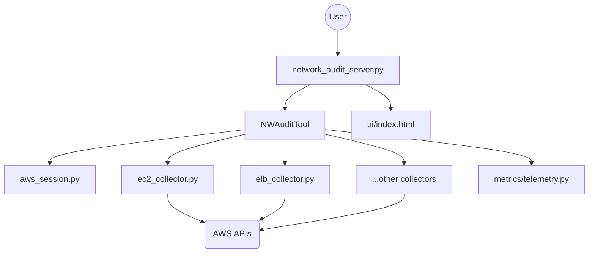

# Architecture: Network Audit System

## Overview
The Network Audit System is a comprehensive toolset designed to perform, collect, and analyze network configuration data within AWS environments.

## High-Level Architectural Pattern
The application follows a modular "collector" pattern, orchestrated by a central audit tool. It exposes an HTTP server (`network_audit_server.py`) for management and integration, with a frontend (`ui/index.html`) for monitoring.

## Information Flow

### Component Interaction Diagram

### Detailed Information Flow
1.  **Request Initiation:** The user initiates an audit request via the HTTP interface (`network_audit_server.py`).
2.  **Orchestration:** The server triggers the `NWAuditTool` (or `AWSAuditTool`), which acts as the central coordinator.
3.  **Session Setup:** The Orchestrator calls `aws_session.py` to establish secure credentials and connection parameters for AWS.
4.  **Collector Dispatch:** The Orchestrator dispatches specific audit tasks to the appropriate specialized collectors (`ec2_collector.py`, `elb_collector.py`, etc.).
5.  **Data Retrieval:** Collectors execute API calls against AWS endpoints using the prepared session.
6.  **Telemetry & Benchmarking:** During execution, collectors interact with the `metrics/` module to log performance and telemetry data.
7.  **Aggregation:** Collectors return raw configuration data to the Orchestrator, which aggregates and processes the results.
8.  **Final Response:** The aggregated report is returned to the `network_audit_server.py` and subsequently to the user.

## Key Components

### 1. Orchestration Layer (`tools/`)
- **`AWSAuditTool.py` / `NWAuditTool.py`**: Serve as the core orchestrators. They manage the workflow of collecting network configuration data, triggering appropriate collectors, and aggregating the results for analysis.

### 2. Data Collection Layer (`tools/`)
The system employs specialized collectors for AWS resources:
- **`ec2_collector.py`**, **`elb_collector.py`**, **`eni_collector.py`**, **`tgw_collector.py`**, **`reachability_collector.py`**: These modules interact with AWS APIs to fetch configuration and reachability data.

### 3. Observability & Analysis (`tools/`)
- **`metrics/`**: Handles benchmarking and telemetry for the audit process.
- **`pqc_observability/`**: A specialized module for observability in Post-Quantum Cryptography (PQC) contexts, including probes for TLS.

### 4. Utilities (`tools/utils/`)
- Provides core infrastructure services: AWS session management, CloudWatch integration for logging/metrics, and execution timers for monitoring performance.

### 5. Server & Frontend
- **`network_audit_server.py`**: Entry point providing an HTTP interface.
- **`ui/`**: Simple HTML/JS interface for interacting with the server.

## Technology Stack
- **Language:** Python
- **AWS Interaction:** Boto3 (implied)
- **Server:** Python-based HTTP server
- **Monitoring:** CloudWatch
